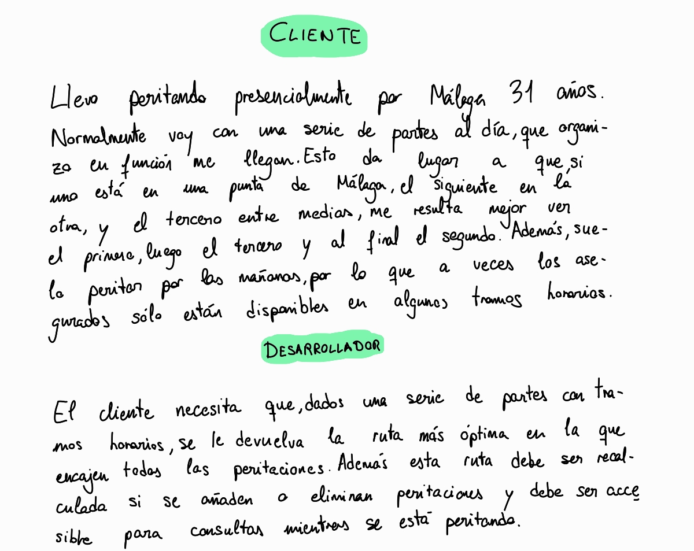
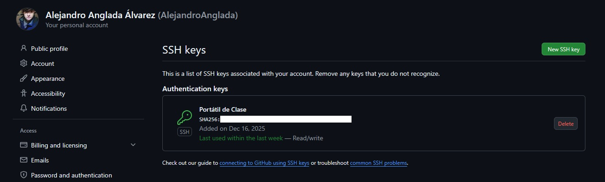

## Tarjetas del juego de rol Cliente - Desarrollador

He decidido pasar a limpio en mi tablet ambas tarjetas.

## Justificación de despliegue en la nube

Se justifica un despliegue en la nube por la necesidad de acceso constante a la planificación de la ruta, para actualizarla en tiempo real, además de la necesidad de recalcular constantemente la ruta cada vez que haya un cambio en las peritaciones.

## Datos del problema

Se distinguen entre dos tipos de datos: los constantes, y los aportados por el cliente.

- **Constantes**. Mi padre utiliza una base de datos hecha con Access para gestionar los informes cerrados y abiertos, y además tiene una hoja de cálculo Excel que me ha facilitado con los tiempos aproximados de desplazamiento entre los distritos de Málaga y La Línea de la Concepción (que es la ciudad en la que reside mi familia).
- **Aportados por el cliente**. Se debe aportar cada peritación para que se pueda ir calculando la ruta. Lo vital es conocer el distrito donde se encuentra el lugar a peritar, la franja horaria en la que está disponible el asegurado y el nombre para poder identificarlo.

## Configuración del repositorio

* Licencia: GNU General Public License, versión 3.
* Control de versiones: Uso de git (mediante clave SSH censurada, véase captura abajo) aplicado a cualidades de desarrollo ágil (creación de ramas, issues, milestones, pipelines CI/CD, etc).

